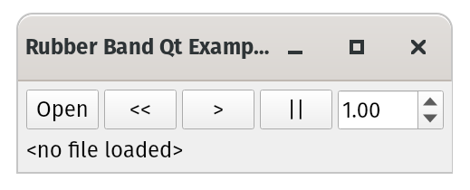

# Rubber Band Qt Example

A simplistic Qt-based UI that can load an audio file and adjust its
playback speed dynamically.



This is actually a very, very cut-down version of code used in the
Rubber Band Audio application, https://rubberbandaudio.com/ .


Libraries needed (atleast these):

libpulse-dev
libaubio-dev
libsndfile1-dev
libfftw3-dev

To build:

```
$ ./repoint install
$ qmake example.pro
$ make
```

Copyright 2020 Particular Programs Ltd. This code is provided for
example purposes only.
